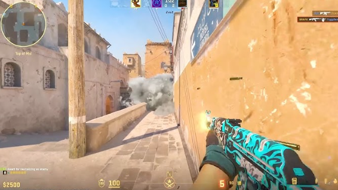
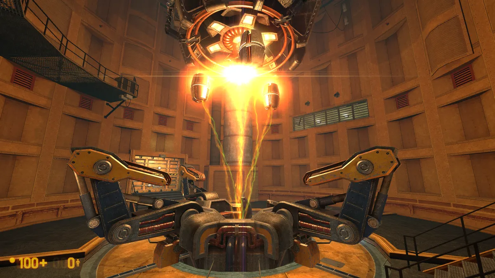

# معرفی بازی های رایانه ای
> از اونجایی که خودم به بازی های ویدئویی علاقه زیادی دارم، پس میخوام چند تا بازی معرفی بکنم

## steam store
> فروشگاه استیم نه تنها بازی نیست بلکه هزاران بازی  داخل خودش گنجونده

## Clash royale
> یک بازی در محیط گرافیکی جذاب که هر ساله با آپدیت هایی که می دهد وضع بازی را بدتر میکند.

## Minecraft
> یک بازی اول شخص تا سوم شخص است که شما به کمک خلاقیت خود جهان بازی را مدیریت می کنید .

## Counter-strike2
>یک بازی اول شخص shooter که میتوانید خشم خود را در بازی به چالش بکشید

 عکسی از محیط بازی

# Half Life 1
>شاید با شنیدن ای اسم خیلیا به خاطرات خود از این بازی فکر کنند . بله!  Half Life  یا همان نیمه جان
بازی بود که در تاریخ 19 نوامبر 1998  منتشر شد .
این بازی علی رغم داستان خوب در محوریت علمی - تخیلی خیلی خوب توانست  قدرت شرکت Valve را به تصویر بکشد .

 خاطراتی خوش با گوردون فریمن .

 

# موسیقی بازی که حتما باید گوش کنید
<audio controls>
  <source src="./assets/audio/adrenaline_horror_halflife1.mp3" type="audio/mp3">
  <source src="./assets/audio/adrenaline_horror_halflife1.ogg" type="audio/ogg">
</audio>

 با تشکر از توجه شما 

